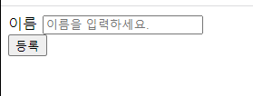
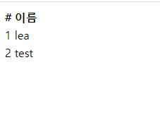

# 회원관리 예제 - 웹 MVC 개발

## 회원 웹 기능 - 홈 화면 추가

`/`으로 접근했을 때 home.html로 연결될 수 있도록 코드를 작성한다.

```java
// HomeController
package hello.hellospring.controller;

import org.springframework.stereotype.Controller;
import org.springframework.web.bind.annotation.GetMapping;

@Controller
public class HomeController {
    @GetMapping("/")
    public String home() {
        return "home";
    }
}

```


```html
<!-- templates/home.html -->
<!DOCTYPE html>
<html xmlns:th="http://www.thymeleaf.org">
<body>
    <div>
        <h1>Hello Spring</h1>
        <p>회원 기능</p>
        <p>
            <a href="/members/new">회원 가입</a>
            <a href="/members">회원 목록</a>
        </p>
    </div>
</body>
</html>
```


## 회원 웹 기능 - 등록

`/members/new`로 접근했을 때 회원가입 페이지(`members/createMemberForm.html`)를 보여줄 수 있도록 코드를 작성해보자.

```java
// MemberController
{
    @GetMapping("/members/new")
    public String createForm() {
        return "members/createMemberForm";
    }
}
```


```html
<!-- createMemberForm.html -->
<!DOCTYPE html>
<html xmlns:th="http://www.thymeleaf.org">
<body>
  <div class="container">
    <form action="/members/new" method="post">
      <div class="form-group">
        <label for="name">이름</label>
        <input type="text" id="name" name="name" placeholder="이름을 입력하세요.">
      </div>
      <button type="submit">등록</button>
    </form>
  </div>
</body>
</html>
```




회원 가입 등록 버튼을 눌렀을 때 post 요청이 갈 수 있도록 코드를 작성해보자. 먼저, `controller/MemberForm`이라는 클래스를 만들어서 객체를 저장할 수 있도록 한다.

```java
package hello.hellospring.controller;

public class MemberForm {
    private String name;

    public String getName() {
        return name;
    }

    public void setName(String name) {
        this.name = name;
    }
}
```

그리고 post 요청을 받아 멤버를 저장하고 `/`으로 리다이렉트하는 코드를 작성해보자.

```java
// MemberController
{
  	@PostMapping("/members/new")
    public String create(MemberForm form) {
        Member member = new Member();
        member.setName(form.getName());

        memberService.join(member);

        return "redirect:/"; // 홈화면으로 redirect
    }
}
```


## 회원 웹 기능 - 조회

`/members`로 접근했을 때 다음 컨트롤러가 실행되도록 코드를 작성한다. `memberList.html` 페이지가 열리게 된다.

```java
// MemberController
{
  	@GetMapping("/members")
    public String list(Model model) {
        List<Member> members = memberService.findMembers();
        model.addAttribute("members", members);
        return "members/memberList";
    }
}
```


```html
<!-- memberList.html -->
<!DOCTYPE html>
<html xmlns:th="http://www.thymeleaf.org">
<body>
  <div>
    <table>
      <thead>
      <tr>
        <th>#</th>
        <th>이름</th>
      </tr>
      </thead>
      <tbody>
      <tr th:each="member: ${members}">
        <td th:text="${member.id}"></td>
        <td th:text="${member.name}"></td>
      </tr>
      </tbody>
    </table>
  </div>
</body>
</html>
```

