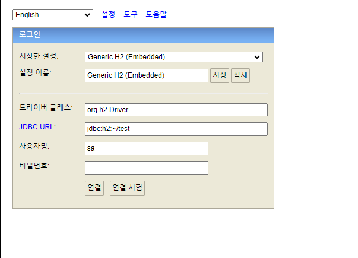
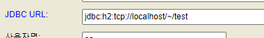
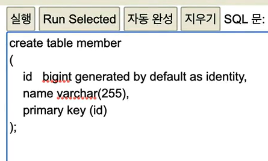

# 스프링 DB 접근 기술


## H2 데이터베이스 설치

개발이나 테스트 용도로 가볍고 편리한 DB, 웹 화면 제공

`C:\Program Files (x86)\H2\bin\h2.bat`을 CLI 환경에서 실행시키면




이러한 화면을 볼 수 있다.






를 통해 member table를 만들 수 있다.


## 순수 Jdbc

- 과거의 db 설정 방식이기 때문에 그냥 들었음.


## 스프링 JdbcTemplate


## JPA

- JPA는 기존의 반복 코드는 물론이고, 기본적인 SQL도 JPA가 직접 만들어서 실행해준다.
- JPA를 사용하면, SQL과 데이터 중심의 설계에서 객체 중심의 설계로 패러다임을 전환을 할 수 있다.
- JPA를 사용하면 개발 생산성을 크게 높일 수 있다.


### 사용법

`build.gradle`을 다음과 같이 작성해야한다.

```gradle
dependecies {
	// ...
	implementation 'org.springframework.boot:spring-boot-starter-data-jpa'
	runtimeOnly 'com.h2database:h2'
	// ...
}
```

`application.properties`를 다음과 같이 수정해보자.

```properties
# jpa가 날리는 sql확인할 수 있다.
spring.jpa.show-sql=true
# 원래는 자동으로 테이블을 만들어주는데 이미 만들어져 있는 테이블을 사용할 것이기 때문에 none
spring.jpa.hibernate.ddl-auto=none
```


jpa는 인터페이스이고 이를 구현하는 여러 vendor?가 hibernate, eclipse 등 여러 개 존재. 

그 중에서 jpa인터페이스에 hibernate를 주로 쓸 예정.

### ORM

Object Relational Mapping. 객체(Object)와 관계형 데이터베이스(Relational Database)를 매핑한다는 의미. 


`domain/Member.java`의 Member 객체에 `@Entity`라는 어노테이션을 추가한다. 이는 JPA가 관리하는 Entity이다라고 의미.

그리고 `@Id`를 붙여 pk를 설정해준다. 그리고 id는 db가 자동으로 생성해주기 때문에 `@GeneratedValue`를 같이 적어준다. 이처럼 db가 자동이로 생성해주는 것을 identity 전략이라고 한다. 

만약 db의 컬럼이름이 name이 아니라 username이면, `@Column(name = "username")`과 같이 어노테이션을 붙여준다. 

```java
package hello.hellospring.domain;

import jakarta.persistence.Entity;
import jakarta.persistence.GeneratedValue;
import jakarta.persistence.GenerationType;
import jakarta.persistence.Id;

@Entity
public class Member {
    @Id @GeneratedValue(strategy = GenerationType.IDENTITY)
    private Long id;
    private String name;

    public Long getId() {
        return id;
    }

    public void setId(Long id) {
        this.id = id;
    }

    public String getName() {
        return name;
    }

    public void setName(String name) {
        this.name = name;
    }
}
```


 JPA를 위한 리포지토리를 만들어보자. `repository/JpaMemberRepository`로 만들 수 있다.

```java
package hello.hellospring.repository;

import hello.hellospring.domain.Member;
import jakarta.persistence.EntityManager;

import java.util.List;
import java.util.Optional;

public class JpaMemberRepository implements MemberRepository{

    private final EntityManager em; // JPA는 entitymanager로 동작하기 때문에 넣어주어야 한다. 스프링부트가 자동으로 만들어주기 때문에 injection만 해주면 된다.

    public JpaMemberRepository(EntityManager em) {
        this.em = em;
    }

    @Override
    public Member save(Member member) {
        em.persist(member); // jpa가 insert query를 다 만들어서 DB에 넣고 id까지 member에다 setId까지 해준다.
        return member;
    }

    @Override
    public Optional<Member> findById(Long id) {
        Member member = em.find(Member.class, id); // find: pk를 통해 조회
        return Optional.ofNullable(member);
    }

    @Override
    public Optional<Member> findByName(String name) {
        //
        List<Member> result =  em.createQuery("select m from Member m whenre m.name = :name", Member.class).setParameter("name", name).getResultList();
        return result.stream().findAny();
    }

    @Override
    public List<Member> findAll() {
        // jpql(jave persistence query language)
        // 테이블 대상으로 sql을 날리는 것이 아니라, 객체(entity)를 대상으로 쿼리를 날리면 sql로 번역이 된다.
        // Member entity를 대상으로 조회하라는 의미.
        // select m => member entity 자체를 select 한다는 의미.
        List<Member> result = em.createQuery("select m from Member m", Member.class).getResultList();
        return result;
    }
}

```


## 스프링 데이터 JPA