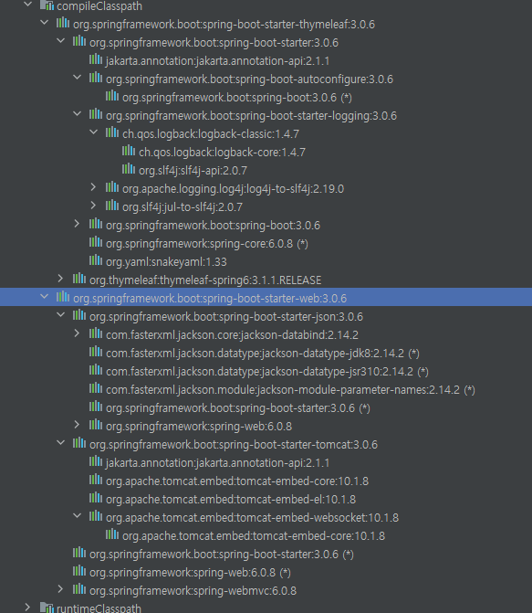

# 라이브러리

실제로 spring boot starter에서 설정했던 것은 `thymeleaf`, `starter-web` 두 가지였으나, 각 라이브러리가 의존하고 있는 라이브러리들이 굉장히 많아서 모두 다 설치됨. => `gradle`

- tomcat 서버 깔고 하지 않아도 됨.

### 스프링 부트 라이브러리

- spring-boot-starter-web
  - spring-boot-starter-tomcat: 톰캣(웹서버)
  - spring-webmvc : 스프링 웹 MVC
- spring-boot-starter-thymeleaf: 타임리프 템플릿 엔진(View)
- spring-boot-starter(공통): 스프링부트 + 스프링 코어 + 로깅
  - spring-boot
    - spring-core
  - spring-boot-starter-logging
    - logback, slf4j

### 테스트 라이브러리

- spring-boot-starter-test
  - junit: 테스트 프레임워크
  - mockito: 목 라이브러리
  - assertj: 테스트 코드를 좀 더 편하게 작성하게 도와주는 라이브러리
  - spring-test: 스프링 통합 테스트 지원