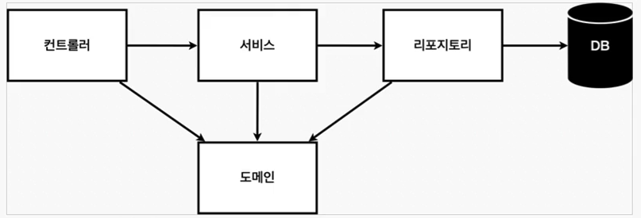
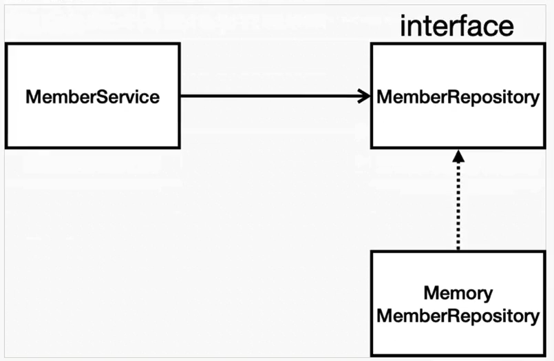
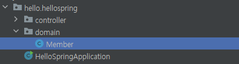
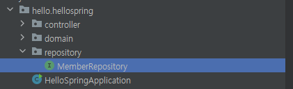
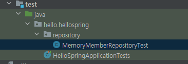
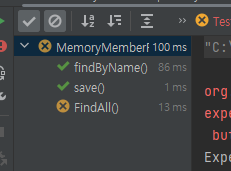
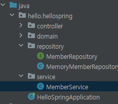
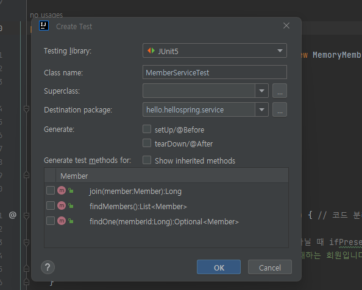
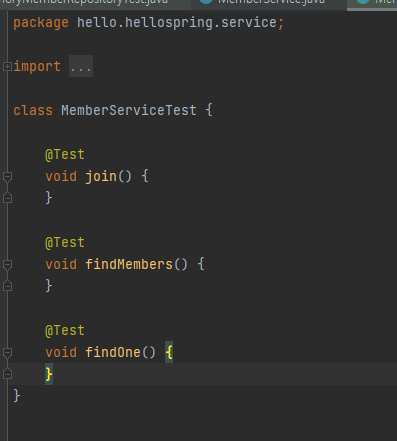

# 회원 관리 예제 - 백엔드 개발

[TOC]

## 1. 비즈니스 요구사항 정리

- 데이터: 회원 ID, 이름
- 기능: 회원 등록, 조회
- 아직 데이터 저장소가 선정되지 않음(가상의 시나리오)


**일반적인 웹 애플리케이션의 계층 구조**



- **컨트롤러**: 웹 MVC의 컨트롤러 역할
- **서비스**: 핵심 비즈니스 로직 구현
  - ex) 회원은 중복 가입이 안됨.
- **리포지토리**: 데이터베이스에 접근, 도메인 객체를 DB에 저장하고 관리
- **도메인**: 비즈니스 도메인 객체
  - ex) 회원, 주문, 쿠폰 등등 주로 데이터베이스에 저장하고 관리됨.

**클래스 의존관계**



- 아직 데이터 저장소가 선정되지 않아서, 우선 인터페이스로 구현 클래스를 변경할 수 있도록 설계
- 데이터 저장소는 RDB, NoSQL 등등 다양한 저장소를 고민 중인 상황으로 가정
- 개발을 진행하기 위해 초기 개발 단계에서는 구현체로 가벼운 메모리 기반의 데이터 저장소 사용


## 2. 회원 도메인과 리포지토리 만들기

**회원 객체**

- hello.hellostring에 `domain`이라는 패키지 생성.

- domain 내에 `Member`라는 클래스 생성

  

```java
// domain/Member.java
package hello.hellospring.domain;

public class Member {
    private Long id;
    private String name;

    public Long getId() {
        return id;
    }

    public void setId(Long id) {
        this.id = id;
    }

    public String getName() {
        return name;
    }

    public void setName(String name) {
        this.name = name;
    }
}
```

**회원 리포지토리**

- `hello.hellospring` 하에 `repository`라는 **패키지** 생성
- `MemberRepository`라는 **인터페이스** 생성



```java
// MemberReposity -> interface
package hello.hellospring.repository;

import hello.hellospring.domain.Member;

import java.util.List;
import java.util.Optional;

public interface MemberRepository {
    Member save(Member member);
    Optional<Member> findById(Long id); // id로 찾았는데 null 일 수 있는데, null을 Optional로 감싸서 반환(JAVA8).
    Optional<Member> findByName(String name);
    List<Member> findAll();
}

```

- `MemoryMemberRepository` 라는 클래스 생성
  - 이전에 만들었던 인터페이스를 `implements`로 상속.

```java
package hello.hellospring.repository;

import hello.hellospring.domain.Member;

import java.util.*;

public class MemoryMemberRepository implements MemberRepository{

    private static Map<Long, Member> store = new HashMap<>(); // 데이터 저장소. <id, member>
    private static long sequence = 0L; // 0, 1, 2 키값을 생성해주는 것
    @Override
    public Member save(Member member) { // 이름은 이미 member 객체 안에 있다는 가정 하에 저장.
        member.setId(++sequence); // store에 넣기 전에 id값을 설정해준다.
        store.put(member.getId(), member); // store에 저장
        return member; // member 반환
    }

    @Override
    public Optional<Member> findById(Long id) { // null이 될 수 있는 값을 감싸는 wrapper 클래스인 Optional 활용.
        return Optional.ofNullable(store.get(id)); // 값이 null 일 수도 아닐 수도 있기 때문에 ofNullable로 값을 저장한다.
    }

    @Override
    public Optional<Member> findByName(String name) {
        // store에서 member의 name이 name과 같은 것을 하나를 찾는 것을 의미
        return store.values().stream()
                .filter(member -> member.getName().equals(name)).findAny();
    }

    @Override
    public List<Member> findAll() {
        return new ArrayList<>(store.values()); // 모든 value 값만 가지고 온다.
    }
}

```

> ❗**추가적으로 공부해야 할 내용**❗ -> 자바의 정석 내용 정리
>
> `interface` / `Optional` / `HashMap` / `Map ` / `ArrayList` / `List` / `stream()` / `findAny()` / `implements` / `generic ` / `static` / `inner class` / `람다식`


## 3. 회원 리포지토리 테스트 케이스 작성

개발한 기능을 실행해서 테스트할 때 자바의 main 메서드를 통해서 실행하거나, 웹 어플리케이션의 컨트롤러를 통해 해당 기능을 실행한다. 이러한 방법은 준비하고 실행하는데 오래 걸리고, 반복 실행하기 어렵고 여러 테스트를 한번에 실행하기 어렵다는 단점이 있다. 자바는 `JUnit`이라는 프레임워크로 테스트를 실행해서 이러한 문제를 해결한다.

**회원 리포지토리 메모리 구현체 테스트**

`src/test/java` 하위 폴더에 생성한다. `MemoryMemberRepository`를 테스트하기 위한 클래스를 생성한다.



- save() 테스트

  repository를 하나 만들어서 테스트 한다.

  **`@Test`를 붙이면 테스트를 위한 메소드를 정의할 수 있다.**

  save에서는 새로운 멤버를 만들어 이름을 저장하고, 해당 멤버를 리포지토리에 저장한다.

  findById의 return 값이 `Optional<Member>`이기 때문에 .get을 사용해 Member 값을 꺼낸다.

  **Assertions.assertEquals를 활용해 두 객체가 같은지 비교한다**.

  ```java
  package hello.hellospring.repository;
  
  import hello.hellospring.domain.Member;
  import org.junit.jupiter.api.Assertions;
  import org.junit.jupiter.api.Test;
  
  import static org.assertj.core.api.AssertionsForClassTypes.assertThat;
  
  public class MemoryMemberRepositoryTest {
      MemoryMemberRepository repository = new MemoryMemberRepository();
  
      @Test
      public void save(){
          // 새로운 멤버를 생성해서 이름을 저장하고, 해당 멤버를 repository에 저장한다.
          Member member = new Member();
          member.setName("spring");
          repository.save(member);
          Member result = repository.findById(member.getId()).get(); // Optional의 값을 꺼내기 위해 .get()을 사용.
          assertThat(member).isEqualTo(result);
        
      }
  }
  
  ```

- findByName() 테스트

  member1, member2를 만든 다음 해당 이름을 가진 멤버가 잘 저장되어 있는지 확인.

  ```java
  {
        @Test
      public void findByName() {
          Member member1 = new Member();
          member1.setName("spring1");
          repository.save(member1);
  
          Member member2 = new Member();
          member2.setName("spring2");
          repository.save(member2);
  
          Member result = repository.findByName("spring1").get();
          assertThat(member1).isEqualTo(result);
      }
  }
  ```

- findAll() 테스트

  member를 두 명 만들어서 레포지토리에 넣어주고 인원 수를 확인한다.

  ```java
  {
      @Test
      public void FindAll() {
          Member member1 = new Member();
          member1.setName("spring1");
          repository.save(member1);
  
          Member member2 = new Member();
          member2.setName("spring1");
          repository.save(member2);
  
          List<Member> result = repository.findAll();
  
          assertThat(result.size()).isEqualTo(2);
  
      }
  }
  ```


세 테스트를 한 번에 돌리면 다음과 같은 에러를 볼 수 있는데,



repository가 clear 되지 않았기 때문이다.

각 함수가 끝날 때마다 클리어 할 수 있도록 코드를 작성해보자.

먼저 `MemoryMemberRepository`에 리포지토리를 비우는 코드를 작성한다.

```java
{
		public void clearStore() { // 모든 항목을 삭제한다.
        store.clear();
    }  
}
```

그 다음 해당 clearStore를 매 함수 호출마다 호출할 수 있도록 `MemoryMemberRepositoryTest` 코드를 수정한다.

```java
{
	@AfterEach // 각 메소드가 실행된 후, 실행되는 메소드.
    public void afterEach() {
        repository.clearStore();
    }
}    
```


검증할 수 있는 **테스트케이스를 먼저 만들고**, 이후에 설계를 하는 것을 **테스트 주도 개발(TDD)**라고 한다!!!!


## 3. 회원 서비스 개발

회원 서비스를 개발해보자.

먼저 service 패키지를 만들고 그 속에 `MemberService` 클래스를 생성한다.




**회원 가입 구현**

- 같은 이름이 있는 중복 회원은 가입이 불가능하다고 가정.

```java
package hello.hellospring.service;

import hello.hellospring.domain.Member;
import hello.hellospring.repository.MemberRepository;
import hello.hellospring.repository.MemoryMemberRepository;

import java.util.Optional;

public class MemberService {
    private final MemberRepository memberRepository = new MemoryMemberRepository();

    // 회원 가입
    public Long join(Member member) {
        // 같은 이름이 있는 중복 회원 X
        validateDuplicatedMember(member);
        memberRepository.save(member);
        return member.getId();
    }

    private void validateDuplicatedMember(Member member) { // 코드 분리
        memberRepository.findByName(member.getName())
            .ifPresent(m -> { // Optional의 값이 null이 아닐 때 ifPresent가 실행된다.
                throw new IllegalStateException("이미 존재하는 회원입니다.");
            });
    }
}
```


**회원 조회**

```java
{
    // 전체 회원 조회
    public List<Member> findMembers() {
        return memberRepository.findAll();
    }

    // id로 회원 조회
    public Optional<Member> findOne(Long memberId) {
        return memberRepository.findById(memberId);
    }
}
```


## 4. 회원 서비스 테스트

서비스 클래스에서 `ctrl` + `shift` + `T`를 누르게 되면, `create Test`를 바로 수행할 수 있다.



다음 파일이 자동으로 만들어진다.




먼저 memberService를 만든다.

```
`given` 뭔가 주어졌는데

`when` 이런 상황에서

`then` 이게 나와야 한다.
```

와 같은 방식으로 테스트케이스를 구현할 수 있다.


**회원가입(예외 처리 포함)**

```java
{
  	@Test
    void 회원가입() {
        // given
        Member member = new Member();
        member.setName("hello");

        // when
        Long saveId = memberService.join(member);

        // then
        Member findMember = memberService.findOne(saveId).get();
        assertThat(member.getName()).isEqualTo(findMember.getName());
    }
  	
    @Test
    void 중복_회원_예외() {
        // given
        Member member1 = new Member();
        member1.setName("hello");
        Member member2 = new Member();
        member2.setName("hello");

        // when
        memberService.join(member1);
        IllegalStateException e = assertThrows(IllegalStateException.class, () -> memberService.join(member2)); // 두번째 인자를 실행시킬 때 첫번째 인자의 에러가 발생함.

        assertThat(e.getMessage()).isEqualTo("이미 존재하는 회원입니다.");
        
    }
  
  	
}
```


각 테스트를 돌릴 때 repository와 memberService를 갱신하기 위해 몇 가지 수정한다.

먼저, memberService 내부에 있는 코드에서, memberRepository를 생성자에서 넘겨 받을 수 있도록 수정한다.

```java
public class MemberService {
    private final MemberRepository memberRepository;

    public MemberService(MemberRepository memberRepository) {
        this.memberRepository = memberRepository;
    }
}
```

MemberServiceTest에서 각 테스트를 실행하기 전에 , 리포지토리와 서비스를 새롭게 생성하고 내용을 지우기 위해 다음과 같이 작성한다.

```java
class MemberServiceTest {

    MemberService memberService;
    MemoryMemberRepository memberRepository;

    @BeforeEach
    public void beforeEach() {
        memberRepository = new MemoryMemberRepository();
        memberService = new MemberService(memberRepository);
    }

    @AfterEach
    public void afterEach() {
        memberRepository.clearStore();
    }
}
```

인자로 memberRepository를 넘겨주게 되는데, 이를 `Dependency Injection`이라고 한다.

