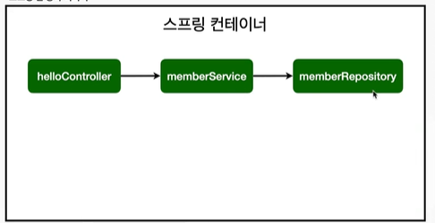
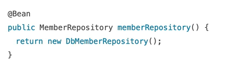

# 스프링 빈과 의존관계

스프링 빈을 등록하는 2가지 방법

1. 컴포넌트 스캔과 자동 의존관계 설정
2. 자바 코드로 직접 스프링 빈 등록


## 컴포넌트 스캔과 자동 의존관계 설정

- `@Component` 에노테이션이 있으면 스프링 빈으로 자동 등록된다.

- `@Controller` 컨트롤러가 스프링 빈으로 자동 등록된 이유도 컴포넌트 스캔 때문이다.

  > **"컴포넌트 스캔"의 의미**
  >
  > 스프링이 실행되었을 때, `@Component`가 붙은 클래스들의 객체를 만들어 컨테이너에 등록을 시킨다. `java/hello.hellospring` 내의 모든 클래스만 스캔한다.

- `@Component`를 포함하는 다음 애노테이션도 스프링 빈으로 자동으로 등록된다.

  - `@Controller`
  - `@Service`
  - `@Repository`

회원 컨트롤러가 회원서비스와 회원 리포지토리를 사용할 수 있게 의존관계를 준비하자.

> 회원 컨트롤러가 회원 리포지토리를 사용해서 회원가입을 구현하기 때문에 "의존한다"라고 표현함.


스프링이 처음 실행되었을 때 스프링 컨테이너가 생기는데, `@Controller`가 붙은 컨트롤러 객체를 생성해서 컨테이너에 넣어두고 스프링이 해당 컨트롤러를 관리한다. 

=> "스프링 컨트롤러에서 스프링 빈이 관리된다".

```java
@Controller
public class MemberController() {}
```


MemberService를 가져다 써야하는데, new로 MemberService를 생성할 경우 문제가 발생할 수 있다. 다른 컨트롤러에서도 MemberService를 사용할 수도 있기 때문인데, 모두 동일한 인스턴스를 바라봐야하기 때문이다. 

이를 해결하기 위해, **스프링이 컨테이너에 모든 것(서비스, 컨트롤러 등)을 등록하고,  스프링 컨테이너에서 받아서 쓰도록 수정할 수 있다.** 

이를 위해 사용하는 것이 `@Autowired`를 사용하는 것이다. 생성자 위에 @Autowired를 달게 되면, 생성자가 호출되었을 때 memberService를 컨테이너에서 찾아 연결시켜준다.

```java
{
  private final MemberService memberService;
  
  @Autowired
  public MemberController(MemberService memberService) {
    this.memberService = memberService;
  }
}
```


그러나 위에 같이 해주면 컨테이너에 등록된 MemberService가 없기 때문에 에러가 발생한다. 그래서 이를 해결하기 위해, `@Service`를 활용해 MemberService를  서비스로 등록해야 한다. 그리고, MemberRepository를 컨테이너로부터 불러오기 위해 `@Autowired`를 생성자에 작성해준다. 

```java
@Service // 스프링 컨테이너에 서비스를 등록시켜준다.
public class MemberService { 
    private final MemberRepository memberRepository;

    @Autowired // MemberRepository 컨테이너로부터 가져오기
    public MemberService(MemberRepository memberRepository) {
        this.memberRepository = memberRepository;
    }
}
```


이와 같이 리포지토리도 동일하게 등록 시켜주기 위해, 구현체에 `@Repository`를 작성해준다.

```java
@Repository
public class MemoryMemberRepository implemen ts MemberRepository{
  // 생략
}
```


이렇게 의존 관계를 넣어 주는 것을 `Dependency Injection`이라 한다.


**스프링 빈 등록 이미지**

`memberSerive`와 `memberRepository`가 스프링 컨테이너에 스프링 빈으로 등록되었다.



> 참고: 스프링은 스프링 컨테이너에 스프링 빈을 등록할 때, 기본으로 **싱글톤**으로 등록한다.(**유일하게 하나만 등록**해서 공유한다.) 따라서 같은 스프링 빈이면 모두 같은 인스턴스다. 설정으로 싱글톤이 아니게 설정할 수 있지만, 특별한 경우를 제외하면 대부분 싱글톤을 사용한다. 


## 자바 코드로 직접 스프링 빈 등록하기

회원 서비스와 회원 리포지토리의 `@Service`, `@Repository`, `@Autowired` 애노테이션을 제거하고 진행한다.


`hello/hellospring` 안에 `SpringConfig` 파일 생성.

`@Configuration`과 `@Bean`을 사용해서 등록해준다.

```java
package hello.hellospring;

import hello.hellospring.repository.MemberRepository;
import hello.hellospring.repository.MemoryMemberRepository;
import hello.hellospring.service.MemberService;
import org.springframework.context.annotation.Bean;
import org.springframework.context.annotation.Configuration;

@Configuration
public class SpringConfig {

    // 스프링이 실행되었을 때 memberRepository와 memberService를 생성하고,
    // memberService에 memberRepository를 넣어준다.
    @Bean
    public MemberService memberService() {
        return new MemberService(memberRepository());
    }

    @Bean
    public MemberRepository memberRepository() {
        return new MemoryMemberRepository(); // DB로 수정할 때 이 부분만 바꾸면 된다.
    }
}
```


**참고 & 주의**

- DI에는 필드 주입,  setter 주입, 생성자 주입 이렇게 3가지 방법이 있다. 의존관계가 실행중에 동적으로 바꾸는 경우는 거의 없으므로 생성자 주입을 권장한다.

- 실무에서 주로 정형화된 컨트롤러, 서비스, 리포지토리 같은 코드는 컴포넌트 스캔을 사용한다. 그리고 정형화되지 않거나, 상황에 따라 구현 클래스를 변경해야 하면 설정(Configuration)을 통해 스프링 빈으로 등록한다.

  - Configuration에서 마지막 부분만 바꾸면 되기 때문이다.

    

- `@Autowired`를 통한 DI는 `helloController`, `MemberService` 등과 같이 스프링이 관리하는 객체에서만 동작한다. 스프링 빈으로 등록하지 않고 내가 직접 생성한 객체에서는 동작하지 않는다.