# 스프링 웹 개발 기초

- **정적 컨텐츠**: 정적 html을 브라우저에 내려주는 방식(파일을 그대로)
- **MVC와 템플릿 엔진**: 서버에서 HTML을 동적으로 바꿔서 내려주는 방식. model-view-controller 패턴
- **API**: JSON 형태로 클라이언트에 데이터를 전달하는 방식.


## 정적 컨텐츠

- 스프링 부트 정적 컨텐츠 기능

  - https://docs.spring.io/spring-boot/docs/3.0.7/reference/htmlsingle/#web.servlet.spring-mvc.static-content

    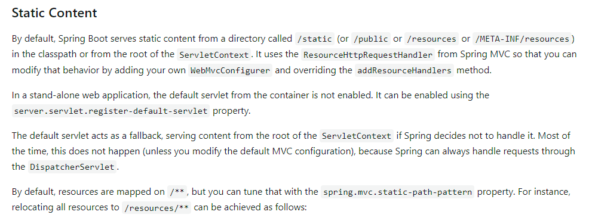

    - 스프링 부트는 기본적으로 클래스 패스 내의 `/static`(`/public`, `/resources`, `/META-INF/resources`) 안에 있거나, ServeletContext의 root 안에 있는 정적 컨텐츠를 제공한다. 

      > **Classpath**
      >
      > JVM이 프로그램을 실행할 때 클래스파일을 찾는데 기준이 되는 파일 경로.
      >
      > 소스코드(`.java`)를 컴파일하면 소스 코드가 "바이트 코드"(`.class`)로 변환되는데, java runtime(`java`, `jre`)으로 이 `.class` 파일에 포함된 명령을 실행하려면, 먼저 이 파일을 찾을 수 있어야 한다. 이때 `.class` 파일을 찾을 때 **classpath에 지정된 경로**를 사용한다.
      >
      > classpath를 지정하기 위해선, 1) *환경 변수 `CLASSPATH`를 사용하거나* 2) *java runtime에 `-classpath`* 플래스를 사용하면 된다.


**실행**

- `resources/static/hello-static.html`을 만든다.

  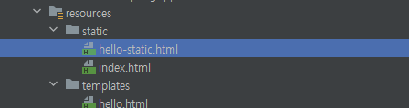

  - http://localhost:8080/hello-static.html로 접근

    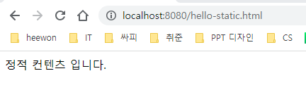


### 동작 과정

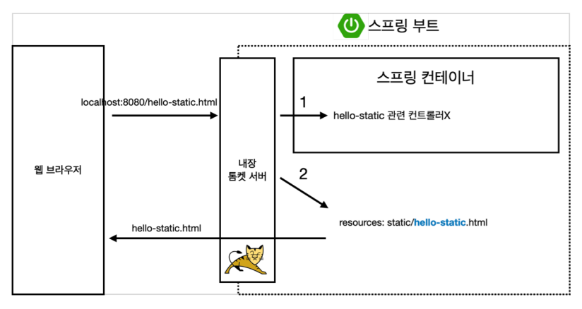

- 웹 브라우저에서 `localhost:8080/hello-static.html` 을 입력

- 내장 톰캣 서버가 요청을 받아서 spring에게 넘김.

- spring은 컨트롤러 쪽에서 hello-static이 있는지 먼저 찾아본다.

- 매핑된 컨트롤러가 없으면 resources 내부에 `hello-static.html` 파일이 있는지 찾는다.

- 있으면 해당 html 파일을 반환한다.


## MVC와 템플릿 엔진

MVC: `Model`, `View`, `Controller`


### Controller

비즈니스 로직 담당. 내부적인 것을 처리.

- `HelloController.java`에 다음과 같은 메소드를 추가하자

  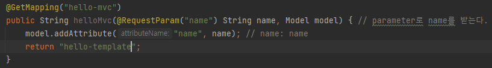

  - `/hello-mvc?{name}`로 요청이 들어왔을 때 
  - model에 name 파라미터를 추가하고
  - hello-template.html(template)에 model을 넘긴다.

### View

화면을 그리는 역할.

- `templates/hello-template.html` 파일을 만든다.

  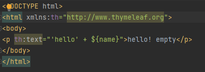

  - thymeleaf 템플릿엔진을 사용.
  - 넘겨준 name 파라미터를 활용하여 템플릿을 만들어 준다.


**실행**

- `http://localhost:8080/hello-mvc`로 접근하면 에러 로그를 확인할 수 있다

```
2023-06-02T18:20:46.952+09:00  WARN 14888 --- [nio-8080-exec-2] .w.s.m.s.DefaultHandlerExceptionResolver : Resolved [org.springframework.web.bind.MissingServletRequestParameterException: Required request parameter 'name' for method parameter type String is not present]
```

 => name 파라미터가 없어서 에러가 난 것을 확인할 수 있다.

> name 파라미터를 꼭 넣지 않아도 작동하도록 설정하고 싶다면 `HelloController.java`를 다음과 같이 수정한다.
>
> 
>
> @RequestParam에 `require=false`를 넣어주게 되면 파라미터를 꼭 넣어주지 않아도 된다.

- `http://localhost:8080/hello-mvc?name="lea"`와 같이 name 파라미터의 값을 넘겨준다

  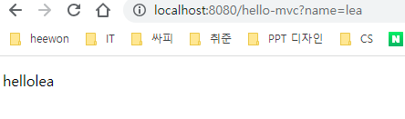

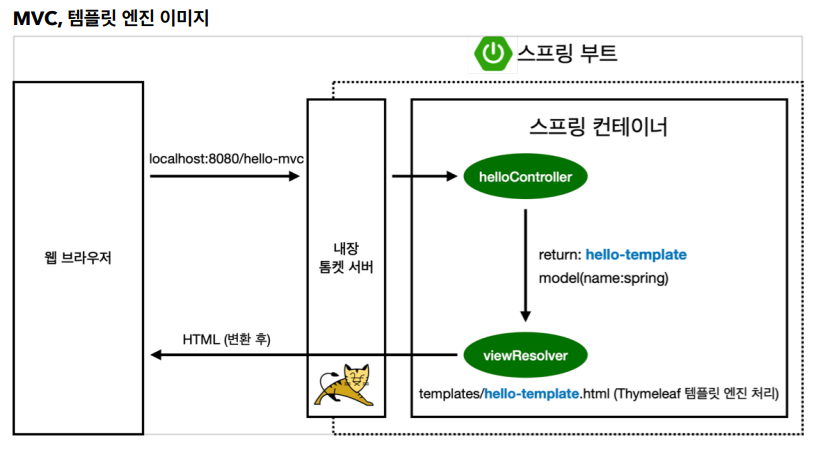

- `localhost:8080/hello-mvc?name=lea`로 요청하면 톰캣서버가 해당 요청을 spring에 넘겨준다.
- helloController에서 hello-mvc와 매핑된 메서드가 실행된다.
- return 값으로 hello-template을 넘겨주고 model에 name:"lea"를 넣어서 넘겨준다.
- viewResolver는 `hello-template.html`파일을 찾아서 thymeleaf 템플릿 엔진과 연결해준다.
- 템플릿 엔진이 렌더링(html 파일은 완성)을 해서 변환한 html을 웹브라우저에 반환한다.


## API

#### 예시1

- `HelloController`에 새로운 메소드를 추가한다.

  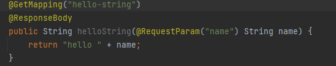

  - `@ResponseBody`를 꼭 추가하자
    - http의 body 부분에 반환값("hello {name}")을 넣어주겠다는 의미.  

**실행**

- `http://localhost:8080/hello-string?name=lea`로 들어가게 되면 "hello lea"가 보내진 것을 알 수 있다.

  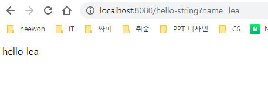

#### 예시 2

JSON 형태의 객체를 전달한다고 가정

- `HelloController`에 다음 내용을 추가한다.

  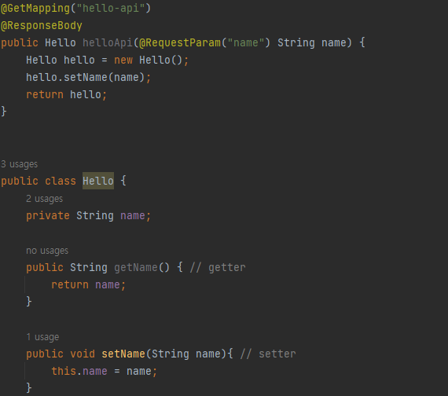

  - `hello-api`로 요청이 들어온다면,
  - {name: ""} 형태로 데이터를 전달하기 위해 `Hello`라는 class를 생성한다. 
  - 요청이 들어왔을 때 `Hello` 객체를 리턴할 메소드 `helloApi`를 정의한다.
  - 내부적으로 name을 setter로 값을 수정한 뒤 hello를 리턴한다.

  > `alt` + `insert` : generate 단축키 => `getter and setter`

  

#### 동작 원리

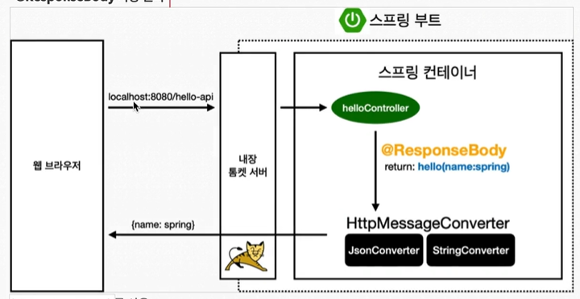

- 웹브라우저에서 `localhost:8080/hello-api`로 요청

- 요청을 내장 톰캣 서버가 스프링으로 전달

- `@ResponseBody`가 붙어있을 때 HTTP의 BODY에 문자 내용을 직접 반환하게 된다.

- return 값을  `HttpMessageConverter`에게 넘겨주게 된다.

  - 만약 return 값이 `string`이면 `StringHttpMessageConverter`가 동작한다.
  - return 값이 객체이면,  `MappingJackson2HttpMessageConverter`가 동작해서 JSON 형태로 만들어서 넘겨준다.

  > **참고**
  >
  > 클라이언트의 HTTP Accept 헤더와 서버의 컨트롤러 반환 타입 정보 둘을 조합해서 `HttpMessageConverter`가 선택된다.


**참고 자료**

https://effectivesquid.tistory.com/entry/%EC%9E%90%EB%B0%94-%ED%81%B4%EB%9E%98%EC%8A%A4%ED%8C%A8%EC%8A%A4classpath%EB%9E%80

