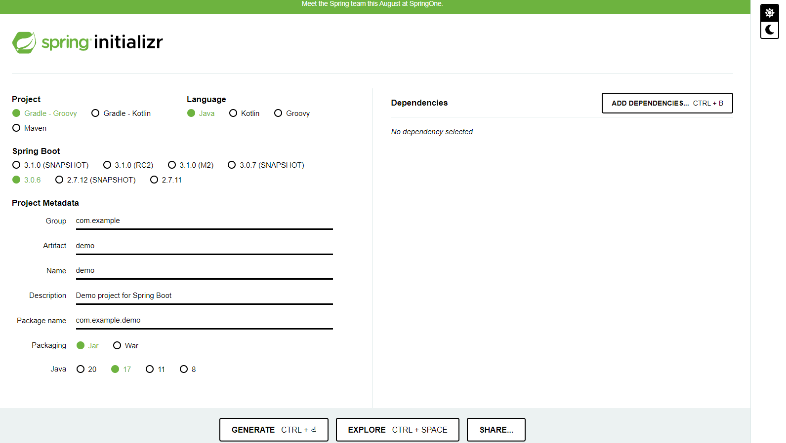
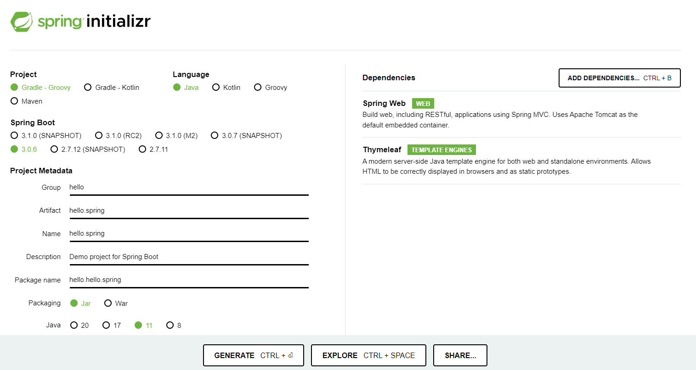
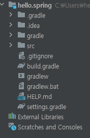
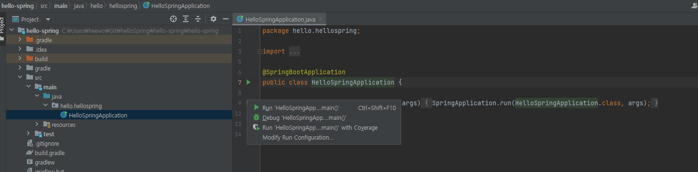
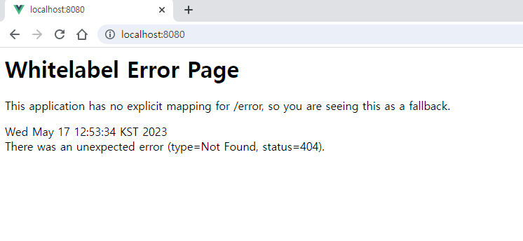
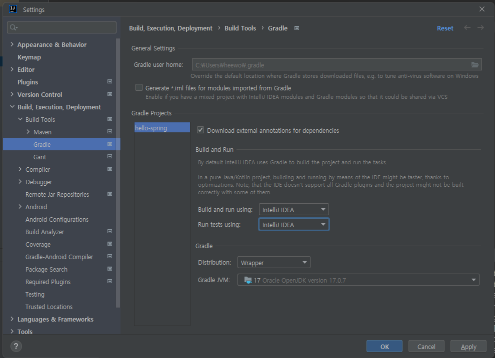

# 1. 프로젝트 환경 설정

## 설치

- Oracle 홈페이지에서 java17 설치
- h2 설치
- intelliJ 설치

## 프로젝트 생성

[spring initailizr](https://start.spring.io/) 에 들어가서 프로젝트를 생성한다.

해당 페이지는 스프링 부트로 스프링 프로젝트를 만들어낼 수 있도록 도와주는 사이트이다.

- **Project ** - *Gradle - Groovy* 

  필요한 라이브러리를 땡겨서 오고, 빌드하는 라이프 사이클까지 관리해주는 툴

  - 과거에는 Maven을 많이 썼지만 요새는 Gradle을 많이 쓴다.

    > ❓왜 그럴까?

- **Langauge** - *Java*

- **Spring Boot** 

  : 스프링 부트의 버전

  - `SNAPSHOT`: 아직 만들고 있는 버전
  - `M#` : 정식 릴리즈 되지 않은 버전.

- **Project Metadata**

  - Group: 보통 기업의 도메인 명
  - Artifact: 빌드되어 나올때 결과(프로젝트명)
  - Name
  - Description

- ⭐**Dependencies**

  - *Spring Web*
  - *Thymeleaf*  : 템플릿 엔진(회사마다 다름)

=> 설정 후 `Generate` 누르기

## IntelliJ로 프로젝트 열기

- 다운로드된 후 압축 풀기 => hello.spring 폴더 생성됨
- `Open` -> `hello.spring/build.gradle` -> `open as a project`

### 폴더구조

- `.idea` : 인텔리제이가 사용하는 설정파일
- `gradle/wrapper`: gradle 관련 폴더
- `src`
  - `main`
    - `java`
      - 실제 소스파일
    - `resources`
      - (java 파일을 제외한) xml이나 html, 설정파일
  - `test`
    - 테스트코드와 관련된 코드
- `build.gradle`: 버전 설정 및 라이브러리..
  - plugins
  - repositories: 어디서 라이브러리 다운을 받는지 명시
  - dependencies: 라이브러리.
- `gradlew`, `gradlew.bat` -> gradle 빌드와 관련된 무언가..

## 프로젝트 실행

- `src/main/java/hello.hellospring/HelloSpringApplication` 의 `main` 함수 실행

- `localhost:8080` 접속

  

  위와 같은 화면이 나오는데, 이렇게 되면 성공!

### 추가 세팅

- `Build and run using` -> IntelliJ IDEA

- `Run tests using` -> IntelliJ IDEA