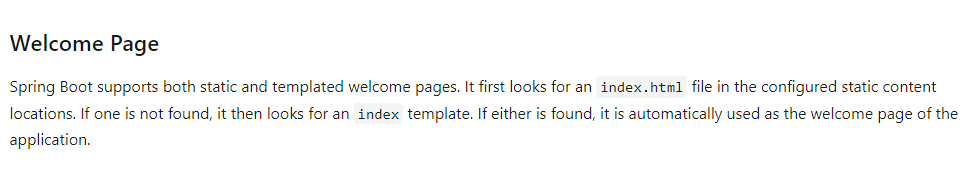
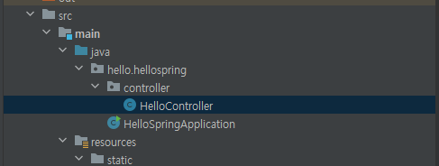
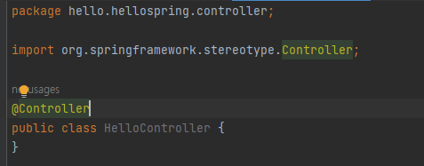
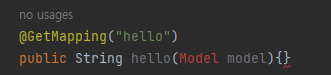
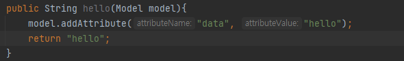
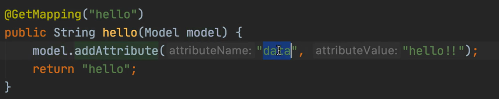

# View 환경설정

- Welcome page 만들기

  `resources/static/index.html`

  ```html
  <!DOCTYPE html>
  <html lang="en">
  <head>
      <meta charset="UTF-8">
      <title>Hello</title>
  </head>
  <body>
  Hello
  <a href="/hello">hello</a>
  </body>
  </html>
  ```

- 스프링 부트가 제공하는 Welcome Page 기능

  - `static/index.html`을 올려두면 Welcome page 기능을 제공한다

  - main함수를 실행시켜 `localhost:8080`에 접근하면 다음 화면을 확인할 수 있다.

    

  - https://docs.spring.io/spring-boot/docs/3.1.0/reference/htmlsingle/#web.servlet.spring-mvc.welcome-page

    => spring 메뉴얼인데, 검색을 할 줄 알아야 한다!

    

    spring boot는 정적의 그리고 템플릿화된 welcome 페이지를 지원한다. `static` 폴더 내의 `index.html`을 먼저 찾는다. 없다면, `index` 템플릿을 찾는다. 둘 중 하나를 찾을 수 있다면 자동으로 웰컴 페이지로 지정된다. 

- thymeleaf 템플릿 엔진

  - thymeleaf 공식 사이트: https://www.thymeleaf.org

  - 스프링 공식 튜토리얼: https://spring.io/guides/gs/serving-web-content

  - 스프링부트 메뉴얼: https://docs.spring.io/spring-boot/docs/3.1.0/reference/htmlsingle/#web.servlet.spring-mvc.template-engines

    => spring boot에서는 템플릿 엔진을 통한 auto-configuration support를 포함한다

    : FreeMarker, Groovy, **Thymeleaf**, Mustache

- 컨트롤러 생성

  - 컨트롤러 폴더를 만든 뒤 내부에 `HelloController`를 만든다.

    

  - `@Controller`(컨트롤러 노테이션)을 적어준다

    

    - 웹에서 `/hello`로 접근하면 `hello` 메소드가 실행될 수 있도록 한다.

      > `Get` method를 사용하기 때문에 `GetMapping`으로 작성.

      

  - data의 값을 "hello"로 전달한다.

    

- template 생성

  - `resources/templates`에 `hello.html` 생성

  - 전달 받은 "data"의 값을 thymeleaf 템플릿 엔진을 통해 값을 넣어줄 수 있다.

    ```html
    <!DOCTYPE html>
    <html xmlns:th="https://www.thymeleaf.org"> <!--타임리프 템플릿 엔진 선언-->
    <head>
        <meta charset="UTF-8">
        <title>Hello</title>
    </head>
    <body>
    <!-- 타임리프 템플릿 엔진을 통해 타임리프 문법을 사용할 수 있음: th -->
    <p th:text="'안녕하세요' + ${data}" >안녕하세요 손님</p>
    </body>
    </html>
    ```


### 동작 과정


1. 웹 브라우저가 `localhost:8080/hello`에 요청을 보낸다.

2. 스프링 부트는 tomcat이라는 웹 서버를 내장하고 있는데, 내장 톰켓 서버가 스프링에게 물어본다.

3. 스프링의 Controller의 `@GetMapping("hello")`이 붙어 있는 메소드가 실행되는데, 스프링이 model를 인자로 함께 넘겨준다.

   

4. 위에서 model에 `data:"hello!!"`로 넣어둔다.

5. 컨트롤러의 리턴값으로 문자("hello")를 반환하면 `viewResolver`가  `resources/template/hello.html`를 찾아 처리한다.

   - 스프링부트 템플릿엔진 기본 viewName 매핑
   - `resources:templates/` + {ViewName} + `.html`

6. 해당 html 파일을 브라우저에 보낸다.


> **참고**
>
> `spring-boot-devtools` 라이브러리를 추가하면, `html` 파일을 컴파일만 해주면 서버 재시작 없이 View 파일 변경이 가능하다.
>
> 인텔리 J 컴파일 방법: 메뉴 build -> Recompile